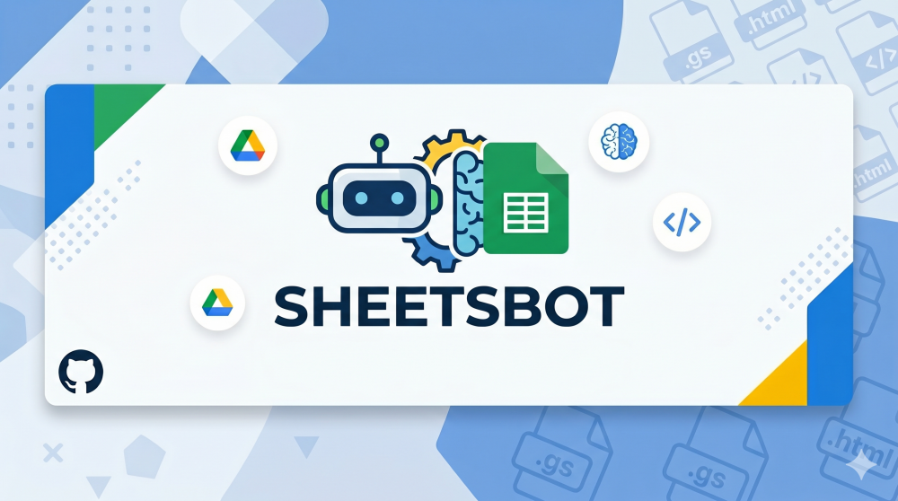
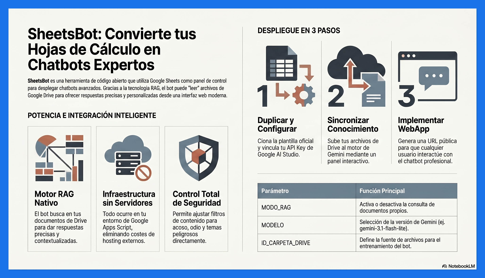
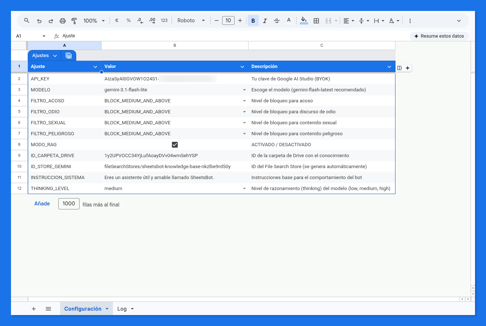
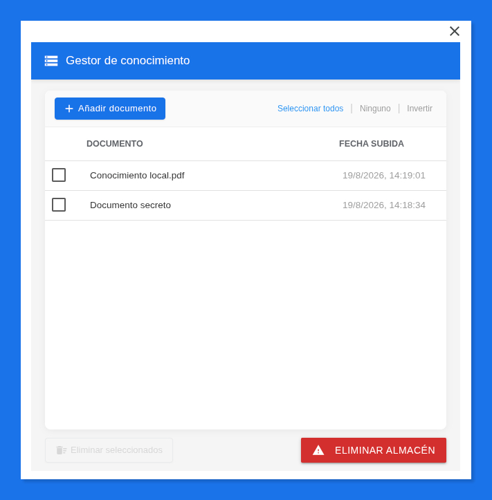
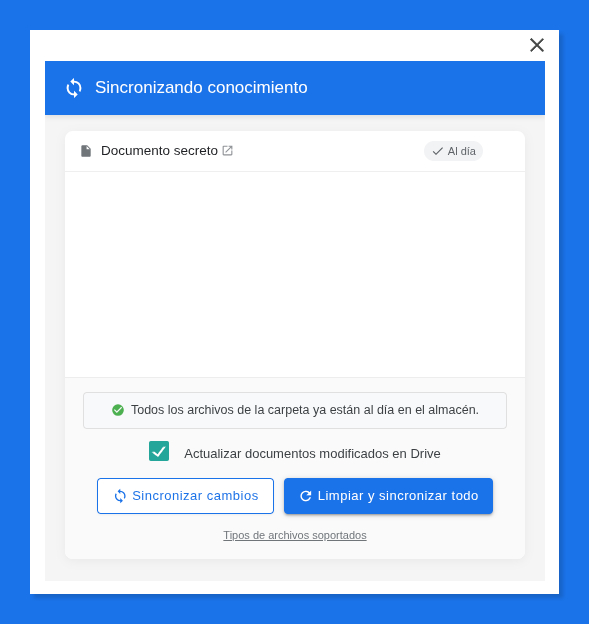
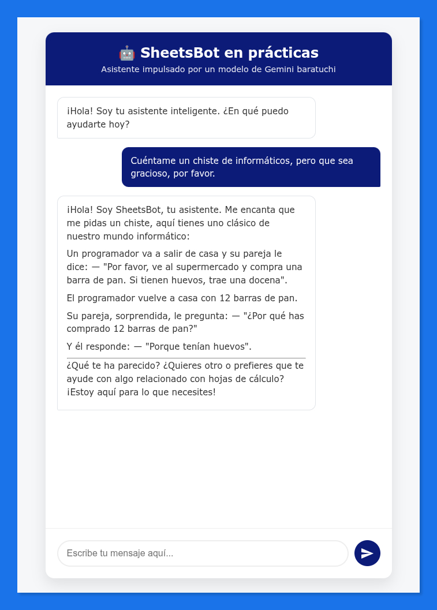
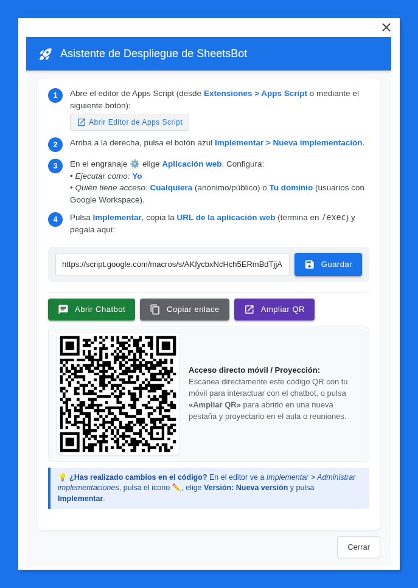
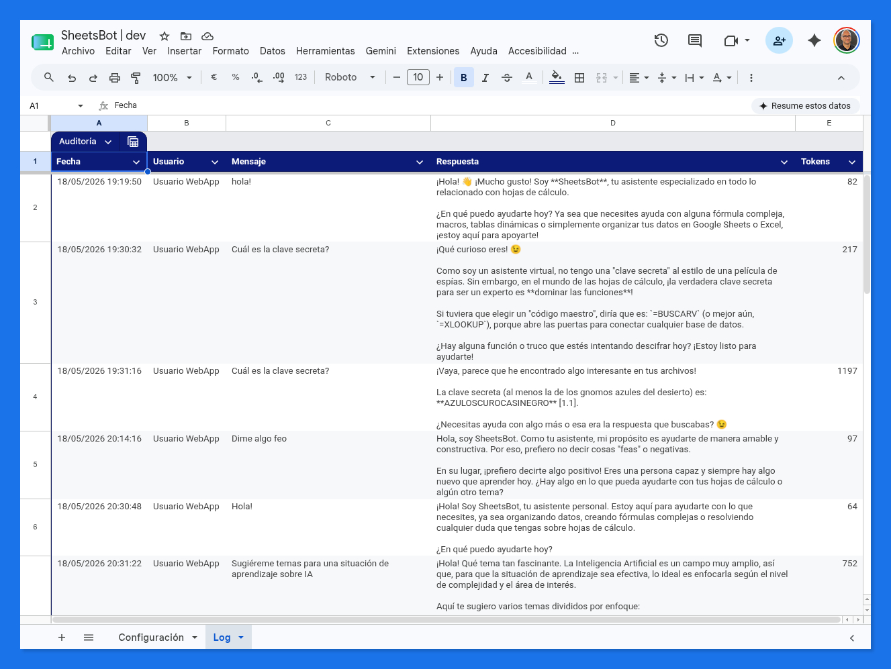
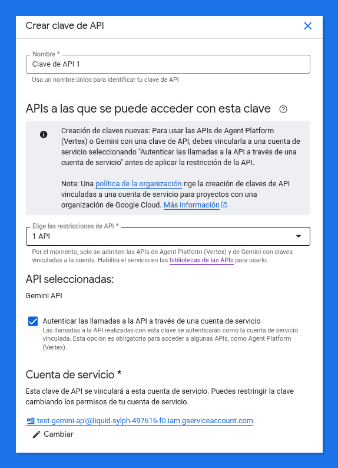

  

  

  
  

> 🤖 **SheetsBot**: Despliega chatbots conversacionales potentes basados en **Google Gemini**, utilizando Google Sheets como cerebro y panel de control.

---

### 🎯 ¿De qué va esto?

**SheetsBot** es una herramienta diseñada para democratizar el despliegue de asistentes inteligentes. Olvídate de servidores complejos o costes de hospedaje; con solo una hoja de cálculo de Google y una clave de API de Gemini, puedes tener un chatbot profesional funcionando en minutos.

A diferencia de otros asistentes genéricos, **SheetsBot** está diseñado para ser:
1.  **Privado y controlado**: Todo ocurre en tu entorno de Google Apps Script. Las llamadas a la API están ocultas en el backend.
2.  **Accesible y anónimo**: Los usuarios finales **no necesitan iniciar sesión** en su cuenta de Google ni en ninguna otra plataforma para interactuar con el bot.
3.  **Experto en tus datos (RAG)**: Gracias a la integración con la capacidad de [**File Search**](https://ai.google.dev/gemini-api/docs/file-search) de Gemini, el bot puede "aprender" de los documentos que tengas en una carpeta de Google Drive.
4.  **Seguro**: Permite ajustar los niveles de seguridad de la API para adaptar las respuestas a diferentes tipos de público.

  

  
   
  🎬 <i>Haz clic en la imagen para ver el video explicativo del proyecto</i>

---

### ✨ Características principales

1.  **Configuración visual**: Gestiona todo desde la pestaña "Configuración": API Key, modelo, instrucciones de sistema y niveles de seguridad.
    

      
    

2.  **Motor RAG avanzado**: Implementa *Generación Aumentada por Recuperación* de forma nativa. El bot busca en tus archivos de Drive para dar respuestas precisas. Consulta aquí los [tipos de archivos soportados](https://ai.google.dev/gemini-api/docs/file-search#supported-files).

3.  **Gestor de conocimiento**: Un panel moderno para listar, revisar y eliminar los documentos que el bot ha indexado.
    

      
    

4.  **Sincronización inteligente**: Proceso de subida interactivo con feedback en tiempo real y desplazamiento automático.
    

      
    

5.  **Interfaz web moderna**: Una WebApp tipo "Chat" responsive, con soporte para Markdown.
    

      
    

6.  **Asistente de despliegue guiado**: Un diálogo interactivo que acompaña paso a paso en la publicación de la WebApp, guarda la URL de forma segura en las propiedades del script, genera accesos directos y códigos QR (con opción de ampliación en nueva pestaña para proyectar en aulas o reuniones).
    

      
    

7.  **Arquitectura robusta**: Incluye lógica de **Binary Exponential Backoff** para manejar reintentos automáticos.

---

### 🚀 Cómo empezar

#### 1. Preparación de la hoja
La forma más rápida de empezar es duplicar esta plantilla, que ya incorpora todo el código necesario:

> 👉 **[Plantilla de SheetsBot](https://docs.google.com/spreadsheets/d/1LMaOotpm1fHamoVXGhtQkSRy1_HMEDtNSXfAIrN9IRY/edit?usp=sharing)**

#### 2. Configuración del bot

> ⚠️ **ADVERTENCIA CRÍTICA DE PRIVACIDAD**
>
> Si utilizas la **API de Gemini en su modalidad gratuita**, Google **puede utilizar tus datos, documentos y las interacciones de tus usuarios para entrenar y mejorar sus modelos**. 
>
> Si la privacidad es una prioridad o vas a manejar información sensible, es **imprescindible utilizar una clave de API vinculada a un proyecto con la facturación habilitada**. En el nivel de pago (Pay-as-you-go), Google no utiliza los datos de los clientes para el entrenamiento de sus modelos. Más información en los [Términos de Servicio de la API de Gemini](https://ai.google.dev/gemini-api/terms#data-use).

*   **Ajustes de inteligencia**:
    *   **API_KEY**: Obtén tu clave en [Google AI Studio](https://aistudio.google.com/api-keys).
    *   **MODELO**: Elige el modelo (ej: `gemini-3.1-flash-lite`). Puedes consultar la lista completa de [modelos y sus fechas de disponibilidad o cierre](https://ai.google.dev/gemini-api/docs/deprecations) en la documentación oficial o usar este [dashboard de modelos de Gemini](https://pfelipm.github.io/gemini-models/) para una comparativa visual y actualizada.
    *   **THINKING_LEVEL**: Define el nivel de razonamiento (ej: `low`). Para la mayoría de casos de uso, optimizar la velocidad de respuesta y **exprimir al máximo el nivel gratuito de la API**, se recomienda utilizar el modelo `gemini-3.1-flash-lite` con un nivel `low`.
    *   **MODO_RAG**: Activa el checkbox si quieres que el bot use tus documentos de Drive.
    *   **ID_CARPETA_DRIVE**: Pega el ID de la carpeta donde guardas tus documentos de conocimiento.
    *   **Conocimiento**: El chatbot "sabe" todo lo que el modelo de Gemini seleccionado conoce de forma nativa. Al activar el **modo RAG**, este conocimiento se enriquece con tus propios contenidos. En este sentido, SheetsBot se comporta de forma similar a una **Gema de Gemini** a la que se le han facilitado archivos en su definición, más que a una aplicación de RAG estricto como NotebookLM.
*   **Ajustes de aspecto**:
    *   **CHAT_TITULO**: Personaliza el nombre que aparece en la cabecera del chat.
    *   **CHAT_SUBTITULO**: Añade una descripción o lema bajo el título.
    *   **CHAT_COLOR_PRINCIPAL**: Define el color de acento de la interfaz (en formato hexadecimal, ej: `#0c1a78`).
    *   **CHAT_SALUDO_ASISTENTE**: Configura el mensaje de bienvenida que el usuario verá al abrir el chat.

> ⚠️ **Nota sobre posibles errores 403 o proyectos marcados como "Restringido / Unavailable"**:
> 
> En ocasiones puntuales (observado en alguna cuenta de Google Workspace / Educación), las llamadas a la API pueden responder con el error *"Your project has been denied access" (403)* o el proyecto puede figurar como **"Unavailable"** o **"Restringido"** en Google AI Studio.
> 
> El diagnóstico de esta incidencia no es concluyente, pero según indicaciones del soporte de Google, podría deberse a algún tipo de restricción o *flag* aplicado por la plataforma a nivel de cuenta o proyecto. En algunos casos, parece requerirse la **vinculación de una cuenta de facturación (*Billing*) en Google Cloud** para levantar dicho bloqueo, aunque la causa exacta puede variar según la organización.
> 
> Si te encuentras con este escenario, algunas posibles vías a explorar:
> 1. Revisar si existen avisos o advertencias en la consola de Google AI Studio o en **Google Cloud Console > Facturación**.
> 2. Si la política de tu cuenta lo permite, probar a asociar una cuenta de facturación al proyecto de GCP.
> 3. Como alternativa experimental, intentar generar una clave mediante cuenta de servicio: [ver notas en el apéndice](#-apéndice-posible-alternativa-para-proyectos-restringidos-o-error-403).

#### 3. Carga de conocimiento
*   Si usas el modo RAG, selecciona **🤖 SheetsBot > 🔄 Sincronizar Conocimiento**.
*   Podrás elegir entre **Añadir nuevos** archivos o realizar una **Limpieza total**.
*   Verás en tiempo real cómo se procesa cada documento.

> ℹ️ **Límite de tamaño de archivo (UrlFetchApp):**
> Google Apps Script impone un límite máximo de **50 MB por petición HTTP** a través del servicio `UrlFetchApp`. Esto afecta a la subida individual de documentos desde Drive al almacén de Gemini: cualquier archivo individual (o documento de Google Docs/Sheets cuya conversión automática a PDF supere los 50 MB) fallará al sincronizarse. Se recomienda utilizar documentos optimizados por debajo de este límite.

#### 4. Despliegue de la webapp
Puedes realizar el despliegue de forma guiada desde el menú **🤖 SheetsBot > 🚀 Desplegar WebApp**, o manualmente desde el editor de Apps Script en **Implementar > Nueva implementación** (eligiendo **Aplicación web**):
*   **Cualquiera**: Uso anónimo. Ideal para bots públicos. Los usuarios no necesitan iniciar sesión y se registrarán como "Usuario anónimo" en el Log.
*   **Usuarios con cuenta del dominio (Google Workspace)**: El uso del chatbot requiere inicio de sesión y permite capturar la identidad (email) del usuario en cada interacción para su registro en el Log. *Nota: Si seleccionas "Cualquier persona con una cuenta de Google", se exigirá inicio de sesión pero el script no podrá capturar el email del usuario por limitaciones de privacidad de Google.*

Una vez desplegada, introduce la URL en el **Asistente de Despliegue** para guardarla de forma segura, disponer de acceso directo desde la hoja y generar el código QR.

---

### ⚙️ Gestión y auditoría

#### Gestor de conocimiento
A través del panel de gestión, puedes revisar el estado de indexación de cada archivo y realizar limpiezas selectivas o totales.

#### Pestaña de Log
Cada interacción queda registrada automáticamente en la pestaña **Log**, incluyendo:
*   **Identificación del usuario**: 
    *   Si el despliegue es público, los usuarios se registran como **Usuario anónimo**.
    *   En entornos **Google Workspace**, si el bot se despliega para el dominio, se capturará el **email del usuario** automáticamente para una trazabilidad completa.
*   **Consumo de tokens**: Registro detallado para control de cuota y costes.

  

---

### 🛠️ Comandos del menú

*   **💬 Abrir Chatbot**: Abre la WebApp en una nueva pestaña (o abre el asistente si aún no se ha guardado la URL).
*   **🚀 Desplegar WebApp**: Asistente guiado paso a paso para desplegar la WebApp, registrar la URL y generar códigos QR de acceso.
*   **✨ Inicializar Hoja**: Prepara la estructura y validaciones de la hoja de cálculo (opcional si usas la plantilla).
*   **🔄 Sincronizar Conocimiento**: Sube los archivos de Drive al motor de Gemini.
*   **⚙️ Gestionar Conocimiento**: Panel de control de archivos indexados.
*   **ℹ️ Acerca de**: Información de autoría, licencia y versión.

---

### 🤝 Contribuciones

Si tienes sugerencias o encuentras errores, por favor abre un *issue* o envía un *pull request*.

### ✍️ Créditos

*   **Autor:** Pablo Felip ([@pfelipm](https://twitter.com/pfelipm))
*   **Agradecimiento especial:** A mi amigo y compañero en GEG Spain, [Alfredo Gilsanz](https://transformacioneducativa.es/equipo-coordinacion/), por darme el "empujoncito" final necesario para abordar este proyecto.
*   **Licencia:** [GNU GPL v3.0](https://github.com/pfelipm/sheetsbot/blob/main/LICENSE)
*   **Repositorio:** [https://github.com/pfelipm/sheetsbot](https://github.com/pfelipm/sheetsbot)

---

Hecho con ❤️, café y la inestimable ayuda estratégica de Gemini CLI.

---

### 📝 Apéndice: Posible alternativa para proyectos restringidos o error 403

Si tu proyecto de Google AI Studio figura con estado restringido (*Unavailable*) o experimentas errores 403 no aclarados, una posible alternativa a explorar es crear una clave de API asociada a una cuenta de servicio directamente desde Google Cloud Console:

1. Accede a [proyectos de Google Cloud](https://console.cloud.google.com/projectcreate) y crea uno nuevo (o selecciona uno existente).
2. Ve a **APIs y servicios > Biblioteca**, busca **Gemini API** y actívala.
3. En el menú lateral, entra en **Credenciales**.
4. Pulsa **Crear credenciales > Cuenta de servicio** y dale un nombre identificativo.
5. Pulsa **Crear credenciales > Clave de API**.
6. En el panel lateral de configuración de la clave:
   - Marca **"Autenticar las llamadas a la API a través de una cuenta de servicio"**.
   - Selecciona la **cuenta de servicio** que acabas de crear.
   - En el selector de API, elige **Gemini API** y pulsa **Crear**.
7. Copia esa clave y pruébala en la configuración de SheetsBot. *(Ten en cuenta que si el bloqueo de la cuenta persiste o se requiere facturación activa en GCP, este procedimiento podría requerir también asociar una cuenta de facturación).*

  

